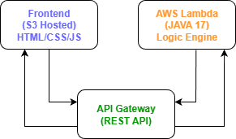

# Daily Water Intake Tracker

A serverless web application built with **Java** and **AWS** to help users track daily water consumption with personalized recommendations.

## Live Demo
**Access Links:**
- **Homepage:** [`http://water-tracker-mufrad.s3.amazonaws.com/index.html`](https://water-tracker-mufrad.s3.amazonaws.com/index.html)

## 📖 Motivation

Many of us forget to drink enough water daily, which leads to:
- Fatigue and low energy
- Headaches and poor concentration
- Digestive issues
- Long-term health problems

Keeping these in mind, I created this simple, accessible tool to provide gentle daily reminders about hydration. Just open it on your phone, track your intake, and get personalized feedback.

## 🏗️ Architecture



### **Flow Explanation:**
1. **User** accesses the S3-hosted website on their phone/computer
2. **Frontend** (HTML/JS) collects user input and sends to API Gateway
3. **API Gateway** routes the request to AWS Lambda
4. **AWS Lambda** (Java) processes the logic and returns personalized message
5. **Response** flows back through API Gateway to the user

## 🛠️ Technology Stack

### **Backend (AWS Serverless)**
- **AWS Lambda:** Java 17 runtime with custom water calculation logic
- **API Gateway:** RESTful endpoints with CORS enabled
- **S3:** Static website hosting

### **Frontend**
- **HTML5/CSS3:** Responsive design with mobile-first approach
- **Vanilla JavaScript:** API calls, DOM manipulation, interactive UI
- **Mobile-First:** Works perfectly on phone browsers

### **Development Tools**
- **Java 17:** Compiled with `--release 17` flag
- **AWS Console:** Infrastructure management
- **AWS CLI:** Deployment automation

## ✨ Features

### 📱 **Mobile Optimized**
- Fully responsive design
- Touch-friendly interface
- Works on any phone browser

### 💧 **Smart Water Calculation**
- **Gender-based recommendations:**
  - Men: 3.7 liters daily (≈ 16 cups)
  - Women: 2.7 liters daily (≈ 12 cups)
- **Multiple measurement units:**
  - Cups (1 cup ≈ 0.25 liters)
  - Bottles (direct liter input)
- **Real-time feedback** with personalized messages

### ⚡ **Serverless Benefits**
- Zero server management
- Auto-scales with usage
- Cost-effective (AWS Free Tier)
- High availability

## 📱 User Journey

1. **Landing Page:** Motivational water-themed introduction
2. **Gender Selection:** Choose Male/Female for personalized thresholds
3. **Measurement Method:** Select between Cups or Bottle
4. **Input Amount:** Enter your daily water intake
5. **Personalized Feedback:** Receive encouragement or reminder

## 📦 Project Files

### **Frontend**
- `index.html` - Homepage with water glass animation and motivational content
- `tracker.html` - Interactive water tracker with step-by-step form

### **Backend**
- `WaterIntakeHandler.java` - Java Lambda function with business logic
- `WaterIntakeHandler.class` - Compiled Java class ready for AWS Lambda

## 🚀 Deployment Steps

### **1. AWS Lambda Setup**
```bash
# Compile Java code
javac --release 17 WaterIntakeHandler.java

# Create Lambda function with Java 17 runtime
# Handler: WaterIntakeHandler::handleRequest
```

### **2. API Gateway Setup**

```bash
# Create HTTP API
# Add POST route: /submit
# Enable CORS
# Connect to Lambda function
```

### **3. S3 Hosting**

```bash
# Create bucket with public access
# Upload index.html and tracker.html
# Enable static website hosting
```

## 🧪 Testing
### API Testing
```bash
curl -X POST https://YOUR_API_ID.execute-api.us-east-1.amazonaws.com/prod/submit \
  -H "Content-Type: application/json" \
  -d '{"gender":"male","mode":"cups","intake":15}'
```

## 🎯 Key Learning Outcomes

### Java in Serverless Environment
- Implementing business logic in AWS Lambda with Java.
- JSON parsing without external libraries.
- Error handling in serverless context.

### AWS Services Integration
- Connecting S3, Lambda, and API Gateway.
- Configuring CORS for web applications.
- Managing permissions and access

### Frontend Development
- Creating mobile-first responsive designs.
- Building interactive forms with JavaScript.
- Implementing smooth user workflows.

## 🔧 Future Enhancements
- User Authentication: Adding AWS Cognito for personalized history.
- Progress Tracking: Weekly/Monthly hydration reports.
- Daily Reminders: Pushing notifications.
- Social Features: Sharing progress with friends via social media.
- Mobile App: React Native or Flutter application.

## 📞 Contact
Mufrad Mahmud - Project Developer
